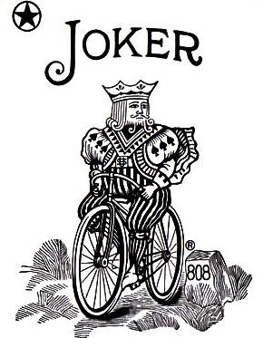
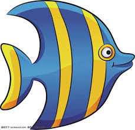

今天我们将重点学习CSS的三个非常有用的特性：CSS过渡（Transition）、2D转换（Transform）和CSS动画（Animation）。这些功能使我们能够为网站添加各种视觉效果，从而增强用户体验和界面的互动性。让我们一步一步来详细了解这些特性。

## **1. 过渡：Transition**

CSS 过渡允许元素从一种样式逐渐变化到另一种样式，使得效果看起来更加平滑。这在改变元素尺寸、颜色、位置等属性时尤为有用。

### **基本属性**

transition 包括以下属性：

- `transition-property: all;` 可以取width, color，background等，如果希望所有的属性都发生过渡，就使用all。
- `transition-duration: 1s;` 过渡的持续时间。
- `transition-timing-function: linear;` 运动曲线。属性值可以是：
    - `linear` 线性
    - `ease` 减速
    - `ease-in` 加速
    - `ease-out` 减速
    - `ease-in-out` 先加速后减速
- `transition-delay: 1s;` 过渡延迟。多长时间后再执行这个过渡动画。

### **示例代码：**

```html
<!DOCTYPE html>
<html lang="en">
<head>
    <meta charset="UTF-8">
    <style>
        body {
            height: 100vh;
        }
        .box {
            margin: 100px auto;
            width: 200px;
            height: 100px;
            background-color: #e6e4f5;
            transition: all 3s ease-in-out 0s;
        }

        .box:hover{
            background-color: #872bff;
            width: 100px;
        }
    </style>
</head>
<body>
    <div class="box"></div>
</body>
</html>
```

在这个示例中，当鼠标悬停在盒子上时，背景颜色会从淡紫色，平滑过渡到深紫色;。

## **2. 2D 转换：Transform**

CSS 2D 转换可以让元素进行移动、旋转、缩放等操作。

通过使用2D转换，我们可以对元素进行移动、缩放、旋转和倾斜。这些转换不仅可以独立使用，还可以组合使用，为元素添加复杂的变形效果。

### **常用函数：**

- **translate(x, y)**：沿X和Y轴移动元素。
- **scale(x, y)**：缩放元素的宽度和高度。
- **rotate(angle)**：围绕中心点旋转元素。
- **skew(x-angle, y-angle)**：沿X和Y轴倾斜元素。

### **示例代码：**

```html
<!DOCTYPE html>
<html>
<head lang="en">
    <meta charset="UTF-8">
    <title></title>
    <style>
        .box {
            width: 200px;
            height: 300px;
            margin: 100px auto;
            position: relative;
        }

        img {
            width: 100%;
            transition: all 1.5s;
            position: absolute;
            left: 0;
            top: 0;
            /*以盒子底部的中心为坐标原点旋转*/
            transform-origin: center bottom;
            box-shadow: 0 0 3px 0 #666;
        }
        .box:hover img:nth-child(6) {
            transform: rotate(-10deg);
        }
        .box:hover img:nth-child(5) {
            transform: rotate(-20deg);
        }
        .box:hover img:nth-child(4) {
            transform: rotate(-30deg);
        }
        .box:hover img:nth-child(3) {
            transform: rotate(-40deg);
        }
        .box:hover img:nth-child(2) {
            transform: rotate(-50deg);
        }
        .box:hover img:nth-child(1) {
            transform: rotate(-60deg);
        }
        .box:hover img:nth-child(8) {
            transform: rotate(10deg);
        }
        .box:hover img:nth-child(9) {
            transform: rotate(20deg);
        }
        .box:hover img:nth-child(10) {
            transform: rotate(30deg);
        }
        .box:hover img:nth-child(11) {
            transform: rotate(40deg);
        }
        .box:hover img:nth-child(12) {
            transform: rotate(50deg);
        }
        .box:hover img:nth-child(13) {
            transform: rotate(60deg);
        }
        .box1 {
            margin: 100px auto;
            width: 100px;
            height: 100px;
            background: green;
            transition: transform 0.5s;
        }

        .box1:hover {
            transform: rotate(45deg) scale(1.5);
        }
    </style>
</head>
<body>
<div class="box">
    
    
    
    
    
    
    
    
    
    
    
    
    
</div>
<div class="box1"></div>
</body>
</html>
```


在这个示例中，实现了展开扑克牌，以及盒子在鼠标悬停时会同时旋转45度并放大1.5倍。

## **3. 动画：Animation**

CSS 动画通过@keyframes规则，可以控制动画序列中的中间步骤，实现更复杂的动画效果。

在CSS中，**`animation`** 属性是一个简写属性，用于设置六个动画相关的子属性：**`animation-name`**、**`animation-duration`**、**`animation-timing-function`**、**`animation-delay`**、**`animation-iteration-count`**、和 **`animation-direction`**。这些属性共同定义了如何以及何时应用CSS动画。

```css
animation: move1 1s alternate linear 3;
```

这里每个值的意义如下：

1. **动画名称 (`animation-name`)**: **`move1`**

    这指定了将要应用的关键帧动画的名称。关键帧必须使用 **`@keyframes`** 规则来定义，这个名字就是与 **`@keyframes`** 中定义的动画相匹配的。

2. **持续时间 (`animation-duration`)**: **`1s`**

    这定义了动画从开始到结束的时长，这里是 1 秒。这个时间长度涵盖了从动画开始到完成一次完整的序列。

3. **执行次数 (`animation-iteration-count`)**: **`3`**

    这指定动画应该播放多少次。这里设置为 3，意味着动画将会完整地播放三次。

4. **是否反向 (`animation-direction`)**: **`alternate`**

    这定义了动画是否以及如何在每次迭代后改变方向。**`alternate`** 表示动画将在奇数次迭代时正向播放，在偶数次迭代时反向播放。这使得动画看起来像是在来回摆动。

5. **运动曲线 (`animation-timing-function`)**: **`linear`**

    这定义了动画的速度曲线。**`linear`** 表示动画从开始到结束将保持相同的速度，没有加速或减速的过程。


此行代码没有明确指定 **`animation-delay`**，这意味着默认没有延迟，动画将在其被应用到元素上时立即开始。

- `linear` 线性
- `ease` 减速
- `ease-in` 加速
- `ease-out` 减速
- `ease-in-out` 先加速后减速

总的来说，这行**`animation`**属性定义了一个名称为**`move1`**的动画，它将在1秒内完成，总共播放3次，每次播放的方向交替变化，以线性的速度曲线运行。这种类型的动画设置使得动画展现出连续和交替的动态效果，适合用于强调交互或视觉引导。

### **示例代码：**

```html
<!DOCTYPE html>
<html lang="en">
<head lang="en">
    <meta charset="UTF-8">
    <title></title>
    <style>
        .box {
            width: 100px;
            height: 100px;
            margin: 100px;
            /* 调用动画*/
            /* animation: 动画名称 持续时间  执行次数  是否反向  运动曲线 延迟执行 */
            /* animation: move1 1s 3 alternate linear 1s; */
            animation: move2 6s ease-in-out;
        }

        /* 方式一：定义一组动画*/
        @keyframes move1 {
            from {
                transform: translateX(0px)
            }
            to {
                transform: translateX(500px)
            }
        }

        /* 方式二：定义多组动画*/
        @keyframes move2 {
            0% {
                transform: translateX(0px) translateY(0px);
            }
            /*动画执行到 25% 的时候，角度向下旋转90*/
            25% {
                transform: translateX(500px) translateY(0px) rotate(90deg);
            }

            50% {
                transform: translateX(500px) translateY(500px) rotate(90deg);
            }

            75% {
                transform: translateX(0px) translateY(500px) rotate(180deg);;
            }

            100% {
                /*坐标归零，表示回到原点。*/
                transform: translateX(0px) translateY(0px) rotate(270deg);
                border-radius: 0;
            }
        }
    </style>
</head>
<body>

</body>
</html>
```

## 总结

通过学习CSS过渡、转换和动画，你可以为你的网页添加视觉上引人注目的效果，提升用户交互体验。这些工具提供了强大的方式来增强你的前端项目，使其更加动态和吸引人
